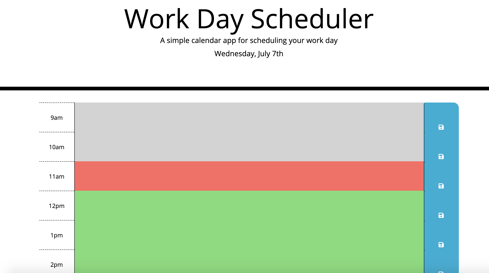

# Work Day Scheduler
## Description
The work scheduler allows the user to load for the day and save their tasks. If the time has past, the time slot is grayed out. If it's current, the time slot is red. If it's in the future, the slot is green. The user is able to click the save button so they can close and reopen and not have to retype their schedule.
## How To Use
Simply open the app and type in your schedule. For each time slot, click the save button so it's saved in case you close the browswer.
## Images

## Links
[Link to deployed application](https://whatawhat.github.io/work_scheduler/)

[Link to Repository](https://github.com/whatawhat/work_scheduler)
## Credits
Created by me: [Stephanie Davis/@whatawhat](https://github.com/whatawhat)
